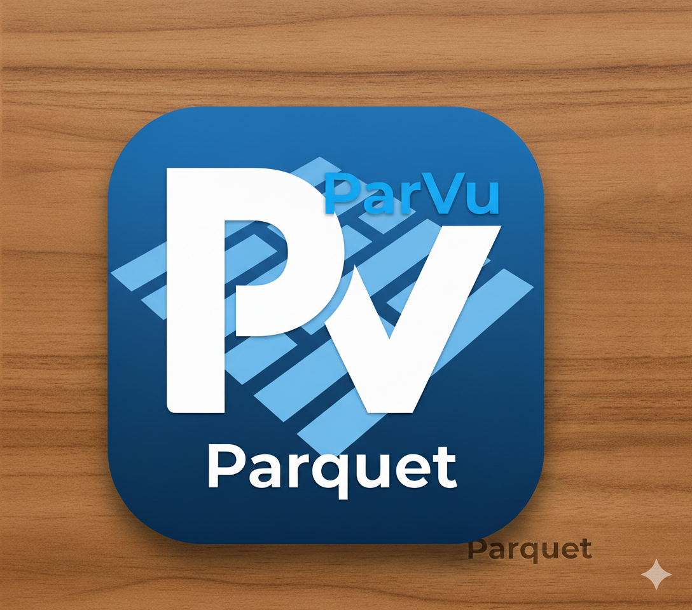

# ParVu - **Par**quet **Vie**wer




## Overview

A powerful desktop application for viewing and querying large Parquet, CSV, and JSON files. Built with [PyQt6](https://www.riverbankcomputing.com/software/pyqt/) and [DuckDB](https://duckdb.org/) for efficient data handling.

## Features

### File Support
- **Parquet** files (.parquet)
- **CSV** files (.csv)
- **JSON** files (.json)
- **Lazy loading** - Files are queried directly without loading into memory
- **Efficient handling** of huge files (8GB+) with pagination

### SQL Querying
- Full SQL query support via DuckDB
- Syntax highlighting for SQL keywords
- Auto-completion for SQL keywords and column names
- Smart query validation

### Table Operations
- **Pagination** - Browse large datasets efficiently (configurable rows per page)
- **Double-click editing** - Edit cell values in the current view
- **Column sorting** - Sort by any column (ascending/descending)
- **Unique values filter** - Excel-like dropdown showing unique column values
- **Copy operations** - Copy column names or values as Python tuple
- **Large file warnings** - Warns when calculating unique values on files >1M rows

### Export Options
- Export query results to:
  - CSV format
  - Parquet format
  - JSON format

### User Interface
- Clean, modern PyQt6 interface
- **Theme System** - 3 built-in themes (Light, Excel, ParVu Black)
- **Internationalization (i18n)** - 3 languages: English, Russian, Azerbaijani
- Import/Export custom themes
- Customizable colors, fonts, and layouts
- Recent files history
- Keyboard shortcuts and auto-complete

## Installation

### For End Users

**Download pre-built packages:**
- **Linux (Ubuntu/Debian)**: Download `.deb` package
  ```bash
  sudo dpkg -i ParVu-0.2.0-amd64.deb
  parvu
  ```
- **Windows**: Download installer or portable `.zip`
- See [RELEASES.md](RELEASES.md) for installation guide

### For Developers

```bash
# Clone the repository
git clone https://github.com/AzizNadirov/ParVu.git
cd ParVu

# Install dependencies using uv (recommended)
uv sync

# Run from source
uv run python src/app.py
```

**Build distributable packages:**
```bash
# Linux
./build.sh

# Windows
.\build.ps1
```

See [BUILDING.md](BUILDING.md) for complete build guide.

## How to Use

### Launch Application

```bash
# Using uv
uv run python src/app.py

# Or directly with file
uv run python src/app.py path/to/your/file.parquet
```

### Basic Workflow

1. **Load File** - Click 'Browse' to select a Parquet, CSV, or JSON file
2. **View Data** - Table displays paginated results automatically
3. **Run Queries** - Write SQL in the editor and click 'Execute'
   - Auto-completion appears after typing 2+ characters
   - Press Tab or Enter to accept suggestions
4. **Navigate** - Use Previous/Next buttons to browse pages
5. **Column Operations** - Right-click column headers for:
   - Copy column name
   - Sort ascending/descending
   - Copy values as tuple
   - Show unique values (with search and filter)
6. **Edit Cells** - Double-click any cell to edit (view only, not saved to file)
7. **Export** - File → Export Results to save query results
8. **Change Theme** - File → Change Theme to switch between Light, Excel, and ParVu Black themes

## Example SQL Queries

```sql
-- View all data (default)
SELECT * FROM data

-- Filter rows
SELECT * FROM data WHERE age > 25

-- Aggregate data
SELECT category, COUNT(*) as count, AVG(price) as avg_price
FROM data
GROUP BY category
ORDER BY count DESC

-- Limit results
SELECT * FROM data LIMIT 100

-- Complex filtering
SELECT * FROM data
WHERE status = 'active' AND created_date > '2024-01-01'
ORDER BY created_date DESC
```

## Configuration

Settings are stored in `~/.ParVu/settings/settings.json`:

- `default_data_var_name` - Table name used in queries (default: "data")
- `result_pagination_rows_per_page` - Rows per page (default: 100)
- `current_theme` - Active theme name (default: "ParVu Light")
- `sql_keywords` - Keywords for syntax highlighting

### Themes

ParVu includes 3 professionally designed themes:
- **ParVu Light** - Default light theme with blue/green accents
- **Excel** - Microsoft Excel-inspired green theme
- **ParVu Black** - Dark theme inspired by Visual Studio Code

Create custom themes or import community themes. See [docs/THEMES.md](docs/THEMES.md) for complete theme documentation.

### Languages

ParVu supports multiple interface languages:
- 🇬🇧 **English** - Default
- 🇷🇺 **Russian** (Русский) - Full translation
- 🇦🇿 **Azerbaijani** (Azərbaycan) - Full translation

Change language in Settings → General tab. See [docs/I18N.md](docs/I18N.md) for i18n documentation.

## FAQ

**Q: What SQL queries are supported?**
A: ParVu supports full DuckDB SQL syntax including SELECT, WHERE, GROUP BY, ORDER BY, aggregations, and window functions. See [DuckDB SQL documentation](https://duckdb.org/docs/sql/query_syntax/select) for details.

**Q: Can I edit the actual file?**
A: No, cell editing only modifies the current view. To save changes, export the results to a new file.

**Q: How large files can it handle?**
A: ParVu uses lazy loading with DuckDB, querying files directly without materializing them in memory. It can efficiently handle huge files (8GB+) with millions of rows. Only the current page is loaded into memory at any time.

**Q: What's the difference from the old version?**
A: This is a complete rewrite with:
- PyQt6 (modern UI framework)
- **Lazy loading** for huge files (8GB+) without memory issues
- **Theme system with 3 built-in themes**
- Better SQL auto-completion
- Excel-like unique value filters
- Improved pagination performance
- More export formats (JSON added)
- Double-click cell editing

**Q: Can I create my own themes?**
A: Yes! Export an existing theme as a template, edit the JSON file to customize colors and fonts, then import it back. See [docs/THEMES.md](docs/THEMES.md) for details.

**Q: Can I add my own language translation?**
A: Yes! The i18n system is fully extensible. See [docs/I18N.md](docs/I18N.md) for instructions on adding new languages.

## Contact
- [Telegram](https://t.me/aziz_nadirov);
### Project:
- [GitHub](https://github.com/AzizNadirov/ParVu);
  
## It has bugs

Yes, it has. Please [open an issue](https://github.com/AzizNadirov/ParVu/issues) and lets solve this
