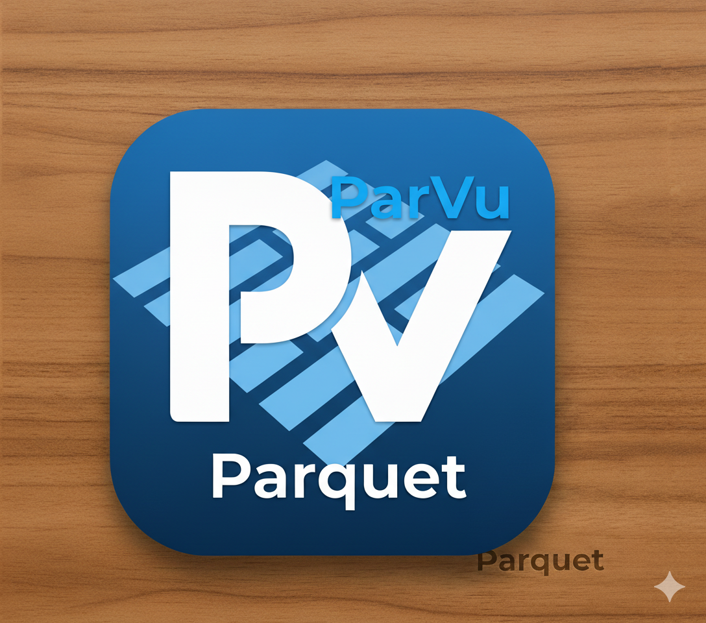
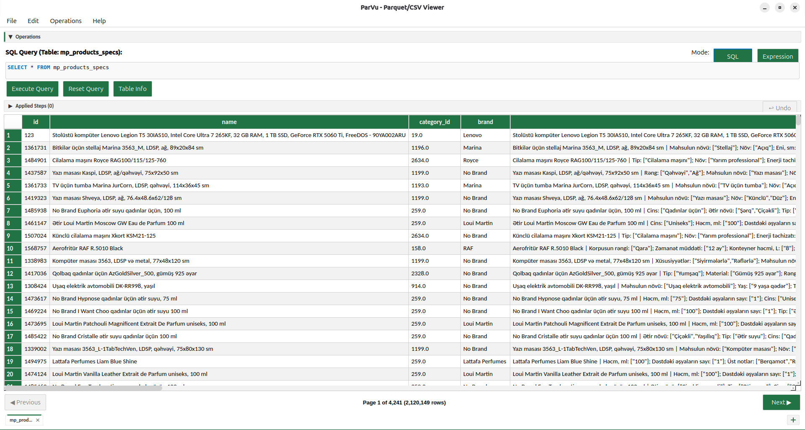

# ParVu - **Par**quet **Vie**wer

<div align="center">
  
</div>


## Overview

A powerful desktop application for viewing and querying large Parquet, CSV, and JSON files. Built with [PyQt6](https://www.riverbankcomputing.com/software/pyqt/) and [DuckDB](https://duckdb.org/) for efficient data handling.

## Features

### File Support
- **Parquet** files (.parquet)
- **CSV** files (.csv)
- **JSON** files (.json)
- **Lazy loading** - Files are queried directly without loading into memory
- **Efficient handling** of huge files (8GB+) with pagination

### SQL Querying
- Full SQL query support via DuckDB
- Syntax highlighting for SQL keywords
- Auto-completion for SQL keywords and column names
- Smart query validation

### Expression Language (DSL)
- **Dual-mode editor** — switch between raw SQL and expression mode
- **Column assignment** — `data[new_col] = old_col * 2` adds computed columns
- **Built-in functions** — `ABS`, `UPPER`, `LEN`, `ROUND`, `REPLACE`, `DROP_DUPLICATES`, `DROP_NULL`, etc.
- **Auto-completion** for functions, columns, table names, and methods in expression mode
- **Function documentation popup** — hover completer items or click function names to see signature, parameters, examples, and SQL mapping
- Seamless compilation to DuckDB SQL behind the scenes

### Table Operations
- **Pagination** - Browse large datasets efficiently (configurable rows per page)
- **Double-click editing** - Edit cell values in the current view
- **Applied steps** - Every transform, sort, filter, and cell edit is tracked
- **Save commits transforms** - `Ctrl+S` writes applied transforms (sort, drop dup, drop null, replace, math) back to the file alongside cell edits; Applied Steps clears after save
- **Undo** - Revert the last applied step (SQL transform or cell edit)
- **Drop duplicates** - Remove duplicate rows via Operations menu or expression
- **Drop null values** - Drop rows where a column IS NULL, or matches a user-supplied sentinel like `-1` / `''` / `N/A`
- **Replace values** - Replace text/regex in columns via Operations menu or expression
- **Column sorting** - Click any column header to sort (toggles asc/desc); sort indicator shown in header
- **Column statistics** - Right-click a header → Column Statistics: rows, non-null, null %, distinct, min, max, mean, std
- **Unique values filter** - Excel-like dropdown showing unique column values
- **Copy operations** - Copy cell selection as TSV (Ctrl+C), CSV, or Markdown; copy column values as Python tuple
- **Drag-and-drop** - Drop files onto the window to open each as a new tab
- **Large file warnings** - Warns when calculating unique values on files >1M rows

### Search
- **Search dialog** (`Ctrl+F`) — finds matches across **every page**, not just the visible one. Pick a specific column or search all. Match case / Whole cell / Regex options. Next/Prev step one match at a time and cache visited matches for instant re-navigation. Selecting a match paginates to the right page and selects the cell.



### Export Options
- Export query results to:
  - CSV format
  - Parquet format
  - JSON format

### User Interface
- Clean, modern PyQt6 interface
- **Theme System** - 3 built-in themes (Light, Excel, ParVu Black)
- **Internationalization (i18n)** - 3 languages: English, Russian, Azerbaijani
- **Operations menu** — Math, Join, Append, Drop Duplicates, Drop Null Values, and Replace Values
- **Edit menu** — Find / Find Next / Find Previous
- **Keyboard shortcut cheatsheet** — `Ctrl+/` shows every shortcut grouped by File / Table / Find / Help
- **Collapsible applied steps** — Toggle the steps panel to save screen space
- **Exit warning** — Warns about unsaved transforms with Save & Close option
- Import/Export custom themes
- Customizable colors, fonts, and layouts
- Recent files history
- Keyboard shortcuts and auto-complete

## Installation

### For End Users

**Download pre-built packages:**
- **Linux (Ubuntu/Debian)**: Download the `.deb` package
  ```bash
  sudo dpkg -i ParVu-<version>-amd64.deb
  parvu
  ```
- **Windows**: Download `ParVu-<version>-setup.exe` (installer with desktop shortcut + .parquet/.csv/.json file associations) or `ParVu-<version>-portable.zip` (extract anywhere, run `parvu.exe`)
- See [RELEASES.md](RELEASES.md) for installation guide and [docs/BUILD_WINDOWS.md](docs/BUILD_WINDOWS.md) for Windows build details

### For Developers

```bash
# Clone the repository
git clone https://github.com/AzizNadirov/ParVu.git
cd ParVu

# Install dependencies using uv (recommended)
uv sync

# Run from source
uv run python src/app.py
```

**Build distributable packages:**
```bash
# Linux
./build.sh

# Windows
.\build.ps1
```

See [BUILDING.md](BUILDING.md) for complete build guide.

## How to Use

### Launch Application

```bash
# Using uv
uv run python src/app.py

# Or directly with file
uv run python src/app.py path/to/your/file.parquet
```

### Basic Workflow

1. **Load File** - Click 'Browse' to select a Parquet, CSV, or JSON file
2. **View Data** - Table displays paginated results automatically
3. **Run Queries** - Write SQL in the editor and click 'Execute'
   - Auto-completion appears after typing 2+ characters
   - Press Tab or Enter to accept suggestions
4. **Navigate** - Use Previous/Next buttons to browse pages
5. **Expression Mode** - Switch the editor to expression mode and write:
   - `data[discount] = price * 0.1` to add a computed column
   - `DROP_DUPLICATES(data[id], data[name], 'first')` to deduplicate
   - Press Execute to compile and run
6. **Column Operations** - Right-click column headers for:
   - Copy column name
   - Sort ascending/descending (or just click the header)
   - Copy values as tuple
   - Show unique values (with search and filter)
   - **Column Statistics** — rows, non-null, null %, distinct, min, max, mean, std
   - **Drop Null Values** — drop rows where this column is NULL (or matches a sentinel like `-1`)
7. **Cell Operations** - Right-click selected cells for:
   - Copy (TSV), Copy as CSV, Copy as Markdown, Copy with Headers
8. **Search** - `Ctrl+F` opens a dialog that searches every row across all pages
9. **Operations Menu** - Use Operations → Drop Duplicates / Drop Null Values / Math / Join / Append / Replace Values
10. **Edit Cells** - Double-click any cell to edit (tracked as an applied step)
11. **Save** - `Ctrl+S` commits cell edits **and** applied transforms back to the file; Applied Steps clears after save
12. **Undo** - Press the ↩ Undo button in the Applied Steps panel to revert changes
13. **Export** - File → Export Results to save query results
14. **Change Theme** - File → Change Theme to switch between Light, Excel, and ParVu Black themes
15. **Drag-and-drop** - Drop one or many files onto the window to open them as tabs
16. **Shortcut cheatsheet** - Press `Ctrl+/` to see every keyboard shortcut

## Expression Language Examples

```python
-- Add a computed column
data[total] = price * quantity

-- Remove duplicates keeping the first occurrence
DROP_DUPLICATES(data[id], data[category], 'first')

-- Drop rows where a column is NULL (or matches a sentinel)
DROP_NULL(data[email])
DROP_NULL(data[score], -1)

-- String and math functions
data[full_name] = UPPER(first_name) || ' ' || UPPER(last_name)
data[abs_diff] = ABS(price - avg_price)

-- Use in expression mode; compiled to DuckDB SQL automatically
```

## Example SQL Queries

```sql
-- View all data (default)
SELECT * FROM data

-- Filter rows
SELECT * FROM data WHERE age > 25

-- Aggregate data
SELECT category, COUNT(*) as count, AVG(price) as avg_price
FROM data
GROUP BY category
ORDER BY count DESC

-- Limit results
SELECT * FROM data LIMIT 100

-- Complex filtering
SELECT * FROM data
WHERE status = 'active' AND created_date > '2024-01-01'
ORDER BY created_date DESC
```

## Configuration

Settings are stored in `~/.ParVu/settings/settings.json`:

- `default_data_var_name` - Table name used in queries (default: "data")
- `result_pagination_rows_per_page` - Rows per page (default: 100)
- `current_theme` - Active theme name (default: "ParVu Light")
- `sql_keywords` - Keywords for syntax highlighting

### Themes

ParVu includes 3 professionally designed themes:
- **ParVu Light** - Default light theme with blue/green accents
- **Excel** - Microsoft Excel-inspired green theme
- **ParVu Black** - Dark theme inspired by Visual Studio Code

Create custom themes or import community themes. See [docs/THEMES.md](docs/THEMES.md) for complete theme documentation.

### Languages

ParVu supports multiple interface languages:
- 🇬🇧 **English** - Default
- 🇷🇺 **Russian** (Русский) - Full translation
- 🇦🇿 **Azerbaijani** (Azərbaycan) - Full translation

Change language in Settings → General tab. See [docs/I18N.md](docs/I18N.md) for i18n documentation.

## FAQ

**Q: What SQL queries are supported?**
A: ParVu supports full DuckDB SQL syntax including SELECT, WHERE, GROUP BY, ORDER BY, aggregations, and window functions. See [DuckDB SQL documentation](https://duckdb.org/docs/sql/query_syntax/select) for details.

**Q: Can I edit the actual file?**
A: No, cell editing only modifies the current view. To save changes, export the results to a new file.

**Q: How large files can it handle?**
A: ParVu uses lazy loading with DuckDB, querying files directly without materializing them in memory. It can efficiently handle huge files (8GB+) with millions of rows. Only the current page is loaded into memory at any time.

**Q: What's the difference from the old version?**
A: This is a complete rewrite with:
- PyQt6 (modern UI framework)
- **Lazy loading** for huge files (8GB+) without memory issues
- **Theme system with 3 built-in themes**
- **Expression language (DSL)** with auto-completion
- **Applied steps with undo** for every transform
- Better SQL auto-completion
- Excel-like unique value filters
- Improved pagination performance
- More export formats (JSON added)
- Double-click cell editing

**Q: Can I create my own themes?**
A: Yes! Export an existing theme as a template, edit the JSON file to customize colors and fonts, then import it back. See [docs/THEMES.md](docs/THEMES.md) for details.

**Q: Can I add my own language translation?**
A: Yes! The i18n system is fully extensible. See [docs/I18N.md](docs/I18N.md) for instructions on adding new languages.

## Contact
- [Telegram](https://t.me/aziz_nadirov);
### Project:
- [GitHub](https://github.com/AzizNadirov/ParVu);
  
## It has bugs

Yes, it has. Please [open an issue](https://github.com/AzizNadirov/ParVu/issues) and lets solve this
